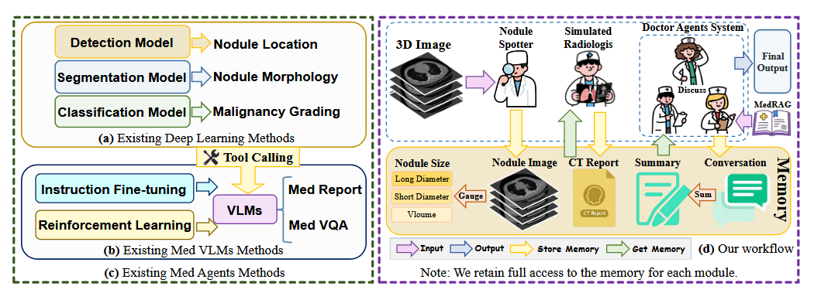
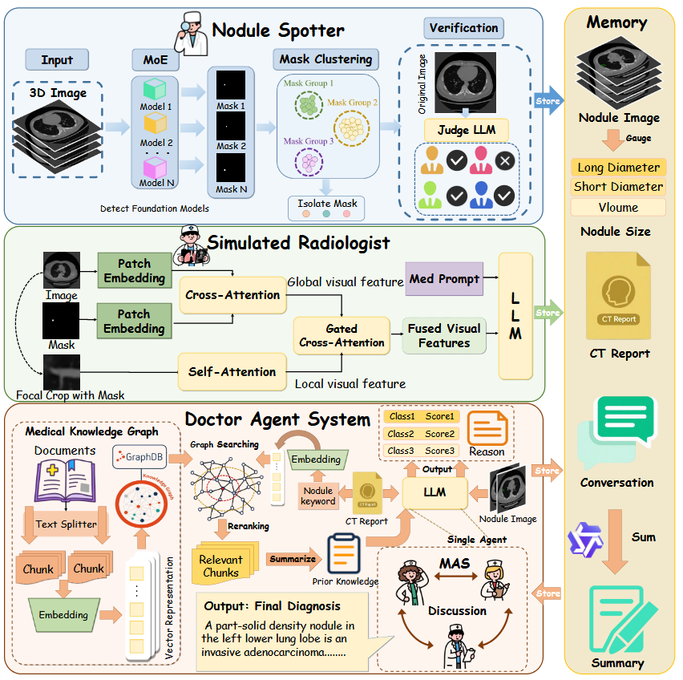

# **1. [LungNoduleAgent](https://ojs.aaai.org/index.php/AAAI/article/view/40225)**

构建肺结节诊断智能体，将诊断过程分为结节定位、局部形态报告生成、以及知识增强的多智能体诊断

## 现有方法缺陷

- 传统CV方法虽然准确性高，但是难以输出解释性的内容
- 传统的VLM虽然会描述图像，但是对于图像的细粒度感知能力不足，特别是结节的区域非常小时，往往难以准确描述结节的细粒度形态
- 虽然经过微调能提高VLM的性能，但是模型依然是依赖内部参数，而不是通过医学证据支持来进行诊断
## 动机
- 作者提出模拟真实的诊断流程，先对结节进行定位，再进行诊断 
- 因此作者设置了三个对应的模块：发现并验证结节、生成局部的CT报告、结合报告和外部知识进行多智能体讨论和恶性分级

## 具体做法

- 模块一：使用多个分割模型进行分割，从中取共识部分，提高分割定位的准确度，并通过LLM对分割结果进行审核
- 模块二：通过分割图、原图和截取的区域图像提取特征，输入LLM中输出CT报告。
- 模块三：通过分割图像、CT报告和根据CT报告在图谱中检索相关的先验知识，一起输入给多个智能体进行多轮讨论，达到共识后输出相关分数和推理内容

