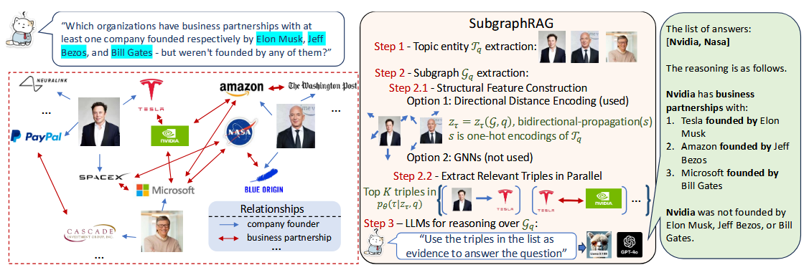
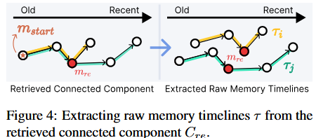
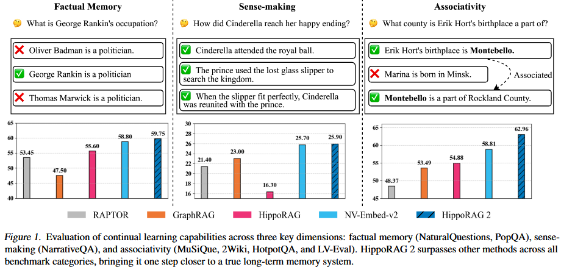
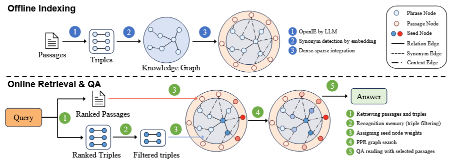

# **1. [SubgraphRAG](https://proceedings.iclr.cc/paper_files/paper/2025/file/11e1900e680f5fe1893a8e27362dbe2c-Paper-Conference.pdf)**
目的是在庞大的知识图谱中找到针对问题的最优子图，从而提高检索效率和生成质量，但是并没有这样的最优子图标签，于是作者这篇文章目的是训练一个检索器，并且将子图搜索退化为三元组搜索，将topic实体的编码信息通过图扩散的方式得到推理路径上的关键三元组，并训练轻量级的网络来学习关键三元组。

# **2. [Theanine](https://aclanthology.org/2025.naacl-long.435.pdf)**

## 动机

现有记忆系统精炼过程中容易照成信息损失，丢失关键细节；并且在检索记忆过程中，如何回忆完整时间线的事件对于回忆关键事件至关重要

## 做法
构建了一个基于图链接的终身记忆结构及检索机制。

1. **在构建记忆阶段**，新记忆节点先通过语义相似度初筛语义节点，再通过LLM判断逻辑关系来精炼相关记忆节点集合，通过相关记忆节点提取出记忆图谱的连通子图，而后将新记忆链接到各个子图的最新的相关记忆节点上。

      

      
      

2. **在检索阶段**，通过query检索多个记忆节点m，然后通过将包含m的连通图分解为多条时间线，作为一个时间线的事件记忆，并通过LLM对多条时间线的记忆进行精炼，然后通过LLM生成最终答案。
      

      
      

## 缺陷
1. 部署时依赖LLM进行推理和裁剪计算开销巨大
2. 缺乏对于高维度记忆信息的抽象能力，每次回复需要从最底层的记忆碎片中重构事件逻辑
3. 预定义的因果关系具有很大的局限性，真实的逻辑关系更加复杂
4. 错误级联和累计，若某次对话LLM生成的答案错误，记忆会原封不动的记住这个错误，没有纠错机制进行修改，随着对话的拉长，该错误会导致模型生成幻觉

# **3. [HippoRAG_2](https://arxiv.org/pdf/2502.14802)**(26-5-25)

## 背景知识(个性化PageRank算法)
### PageRank算法
早期谷歌使用该算法来找出众多网页中权威、重要的网页界面：
假设有一个冲浪者在浏览网页，
- 每次浏览时都会有 $\alpha$ (阻尼系数) 85%的概率点击网页中的出站链接，从而沿着网络进行扩散；
- 另外有15%的概率跳转浏览无关的其他页面

通过多次统计网页访问频率从而能找出引用最多的网页，得到权威、重要的网页

### 个性化PageRank算法(PPR)
这15%的概率不再时随机跳转页面，而是返回到预设的种子节点，这样扩散的页面会围绕种子节点，找出相对于种子节点重要的网页

## 动机

### 局限性
- 真正的智能体需要有持续学习、整合、利用新知识的能力，但是目前在持续学习的过程中会遇到灾难性遗忘的问题
- 传统的RAG方法难以符合“意义构建”(理解长文本中的复杂语义关系)和“联想”(建立不同事实之间的多条联系)的能力
- 而现有结构化的RAG虽然能解决上面缺陷，但是只有在预设定任务的情况下表现较好，对于最基础的“事实记忆”反而低于标准RAG。原因是结构化摘要难以避免的丢失掉事实细节(不同的任务设定包括大规模的对话理解、简单的QA任务、以及多条的QA任务)

      

### HippoRAG初代原理
- 基于大模型的开放信息抽取：让LLM抽取知识库文档中知识三元组，从而构建一个结构化的“海马体”知识图谱
- 而在用户提问时，会从问题中抽取实体作为种子节点，通过**PPR**算法在知识图谱中进行扩散
#### 缺陷
- 在三元组提取过程中上下文严重损失
- 在检索过程中，概念检索在图谱中，而文章相似度检索作为另一条路线，两者分数相加往往会冲淡某些看似无关其实逻辑上关键的内容
- 在事实记忆任务上严重退化，对于简单的检索问题(某人的生日是哪天)甚至不如最传统的RAG方法
- 缺乏在线抗噪，存在错误扩散，PPR属于离线扩散，盲目扩散可能引入大量有歧义或和答案无关的噪声节点

## 主要做法

该方法主要分为离线索引和在线检索和QA的过程，离线索引包括：LLM开放抽取三元组、同义词检测与链接、密集稀疏整合；在线检索包括：文章和三元组联合检索、三元组过滤、分配种子节点权重、PPR图扩散以及最后的QA

      

- 受益于大脑密集-稀疏编码的机制，论文将概念节点作为稀疏的记忆编码，将文章也作为知识图谱中的节点，作为密集编码。
- 文章提出了三种不同的查询和图谱对齐方式：1. 提取实体到图节点对齐；2. query语义嵌入到图节点的对齐；3. query嵌入到图谱三元组的对齐，默认采用第三种方式
- 作者任务回忆和识别是两个过程，因此将query到三元组的检索过程分解为相似度检索和LLM筛查
- 在线检索将候选的段落节点和概念节点作为种子节点来进行PPR图扩散，从而得到最终的检索内容。

