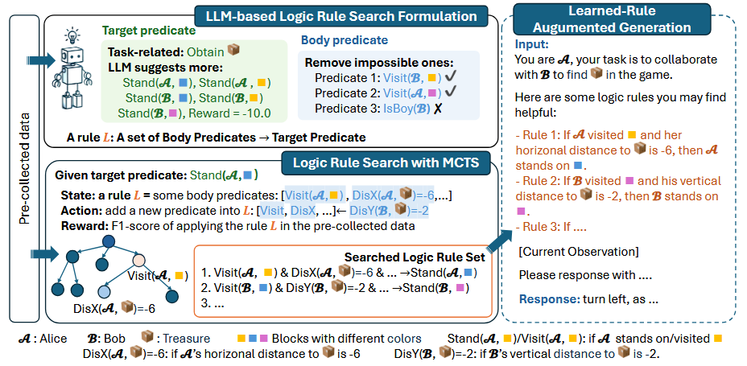
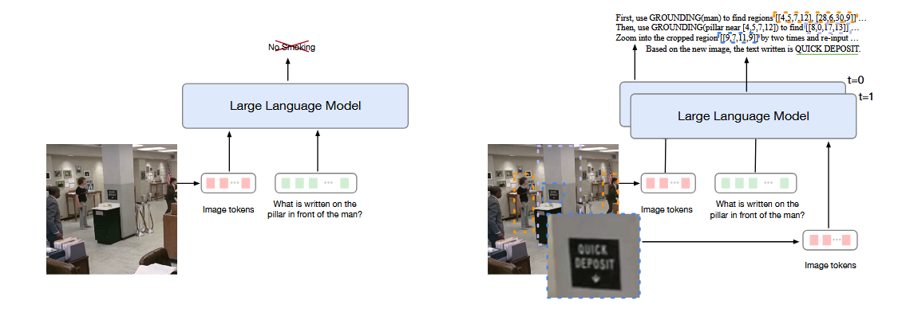
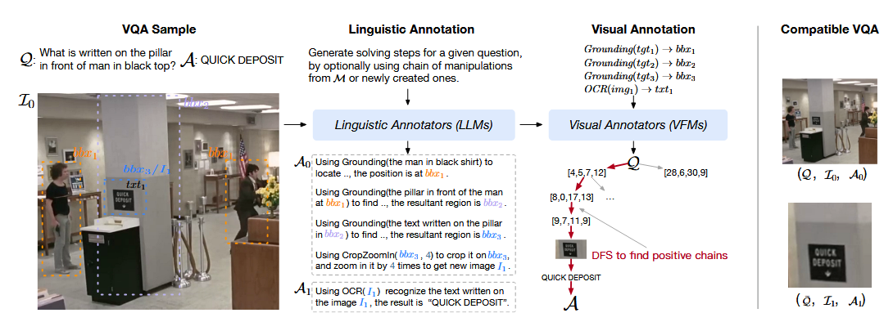
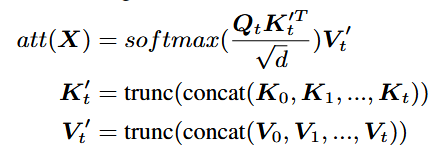
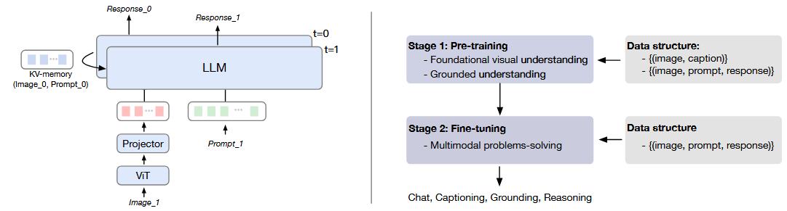

# **1. [RuAG](https://proceedings.iclr.cc/paper_files/paper/2025/file/5d7e8991f75f3e5af14edf7aebb5be5e-Paper-Conference.pdf)(26-5-26)**

本文提出了一种利用外部数据来增强模型推理能力的方法

## 现有缺陷
- 基于微调的方法需要消耗大量计算资源的时间，并导致过拟合和灾难性遗忘
- 上下文学习(ICL)往提示词中注入示例，依赖手工设计的模板，并且受限与模型有限的上下文。
- RAG依赖于检索文档的质量，并且当检索模块过重会消耗计算资源
- KG知识图谱的方法需要人工和专家知识，难以实现大规模的扩展

作者讲数据中蕴含的规则定义为主体谓词和目标谓词，即当A事件(主体谓词)发生时，会发生B事件(目标谓词)，其不像ICL和RAG需要复杂的上下文，而且比KG更加契合LLM的训练过程

因此作者提出的算法分为三个阶段：
1. 基于LLM的逻辑规则搜索构建，这部分利用LLM的常识来将外部的大量数据构建为由主体谓词和目标谓词构成的规则，目标谓词被定义为与任务相关的谓词，如分类任务的类别标签，而主体谓词主要指的是数据的属性
2. 通过蒙特卡洛树搜索将探索数据中的规则，从而减小搜索空间
## 做法

      

1. 阶段1：构建规则搜索空间

- 定义目标谓词：明确要推理的核心目标
- 提取候选谓词：提取数据集中所有的特征列
- LLM智能修建：利用LLM常识先剔除一些任务不相关的特征列

2. 阶段2：基于MCTS的规则搜索构建

- 将不同的特征组合成一阶逻辑规则
- 数据集客观验证：将逻辑规则返回到训练数据集中进行验证，计算精确度和覆盖率
- 将规则进行过滤和去重，保留分数高的规则

3. 阶段3：规则增强生成

将提炼的规则翻译为自然语言，并注入到提示词中进行推理生成。

# **2. [CogCoM](https://proceedings.iclr.cc/paper_files/paper/2025/file/1dcee1cd6890ab7fcdf173ec10526da9-Paper-Conference.pdf)(26-5-27) COGCOM: A VISUAL LANGUAGE MODEL WITH CHAINOF-MANIPULATIONS REASONING**

本文提出了一种针对多模态模型VLM的增强推理方法，主要采用的是提出了一种基于操作链的方法。

## 动机

-  现有的多模态训练主要分为两个阶段：第一阶段是大量图像文本对预训练，使模型具有内在的理解图像的能力；第二阶段是针对任务的指令微调。但是这种方法仅仅基于输出来指令微调，忽略任务中间的视觉推理过程，因此通常会产生幻觉。
- 而人类在进行视觉推理任务时通常会主动对图像进行操作，如：放大局部细节、将视线定格在关键位置上。

      

## 做法

受此启发，作者提出一种操作链机制，每一步都会对输入图像和输出结果进行操作。论文主要分为操作设计、数据收集、模型架构和训练过程。

### 操作设计

通过GPT-4来推理大量数据集中，每条数据可能用什么图像操作来促进问题解决，最终归纳出6种原子操作，包括：OCR、Grounding、Counting、Calculate、CropZoomIn、Line

### 数据构建
作者分别用文本大模型和视觉基础模型对数据进行自动化标注，如下图所示。对于复杂的数学几何问题，则采用人工标注的方式，并将数据转化为多轮VQA的形式

      

### 模型架构

论文模型结构包括四个部分：1）视觉编码器；2）MLP投影层；3）LLM主干；4）视觉专家模型
其中，为了高效处理多轮视觉操作对话，作者采用KV-memory来减少计算并保持全局信息。

      

      

### 训练流程

- 先通过大量图像文本对进行预训练对齐
- 再通过构建的操作链数据，对模型进行指令微调，赋予模型主动操作图像后进行推理的能力。

## 缺陷

- 大量中间对话会产生推理延迟
- 预定义的原子操作的覆盖范围有限
- 模型上限受到预标注模型性能的影响
- 未来多模态模型应该具有主动感知和探索的能力，并且可以在中间过程中，并且论文证明了将主动操作工具能力能够内化到一个端到端的模型中。

# **3. [Visual SKETCHPAD](https://proceedings.neurips.cc/paper_files/paper/2024/file/fb82011040977c7712409fbdb5456647-Paper-Conference.pdf) Visual SKETCHPAD: Sketching as a Visual Chain of  Thought for Multimodal Language Models (26-5-26)**

本文提出了一种通过绘制类似流程图、辅助线之类的草图来增强多模态推理的方法，旨在通过模仿人类绘制草图的方法来增强推理能力。

## 研究背景
