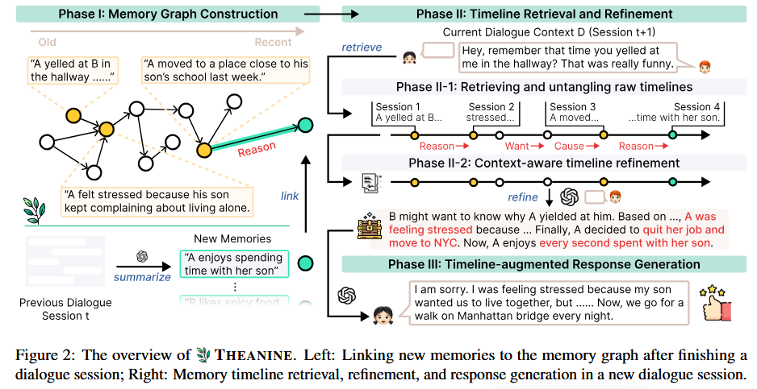
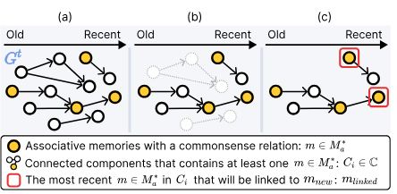

# **1. SubgraphRAG**
目的是在庞大的知识图谱中找到针对问题的最优子图，从而提高检索效率和生成质量，但是并没有这样的最优子图标签，于是作者这篇文章目的是训练一个检索器，并且将子图搜索退化为三元组搜索，将topic实体的编码信息通过图扩散的方式得到推理路径上的关键三元组，并训练轻量级的网络来学习关键三元组。

# **2. Theanine**
构建了一个基于图链接的终身记忆结构及检索机制。

1. **在构建记忆阶段**，新记忆节点先通过语义相似度初筛语义节点，再通过LLM判断逻辑关系来精炼相关记忆节点集合，通过相关记忆节点提取出记忆图谱的连通子图，而后将新记忆链接到各个子图的最新的相关记忆节点上。

      

      
      

2. **在检索阶段**，通过query检索多个记忆节点m，然后通过将包含m的连通图分解为多条时间线，作为一个时间线的事件记忆，并通过LLM对多条时间线的记忆进行精炼，然后通过LLM生成最终答案。
      

      
      

## 缺陷
1. 部署时依赖LLM进行推理和裁剪计算开销巨大
2. 缺乏对于高维度记忆信息的抽象能力，每次回复需要从最底层的记忆碎片中重构事件逻辑
3. 预定义的因果关系具有很大的局限性，真实的逻辑关系更加复杂
4. 错误级联和累计，若某次对话LLM生成的答案错误，记忆会原封不动的记住这个错误，没有纠错机制进行修改，随着对话的拉长，该错误会导致模型生成幻觉

# **3. [HippoRAG_2](https://arxiv.org/pdf/2502.14802)**

## 背景知识(个性化PageRank算法)
### PageRank算法
早期谷歌使用该算法来找出众多网页中权威、重要的网页界面：
假设有一个冲浪者在浏览网页，
- 每次浏览时都会有 $\alpha$ (阻尼系数) 85%的概率点击网页中的出站链接，从而沿着网络进行扩散；
- 另外有15%的概率跳转浏览无关的其他页面

通过多次统计网页访问频率从而能找出引用最多的网页，得到权威、重要的网页

### 个性化PageRank算法
这15%的概率不再时随机跳转页面，而是返回到预设的种子节点，这样扩散的页面会围绕种子节点，找出相对于种子节点重要的网页

## 动机做法

### 局限性
- 真正的智能体需要有持续学习、整合、利用新知识的能力，但是目前在持续学习的过程中会遇到灾难性遗忘的问题
- 
