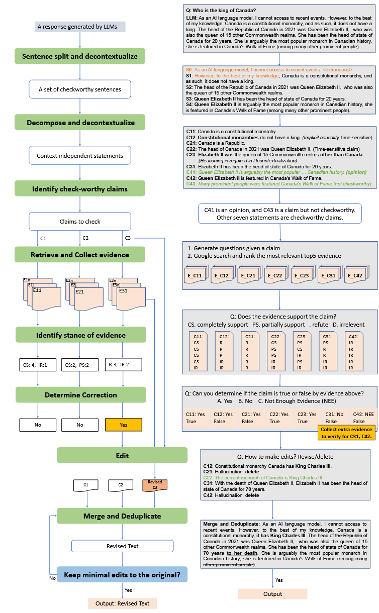

# 输出阶段

增强模型的推理能力可以通过对输出阶段的约束来减少模型幻觉，从而提高推理的准确性。
而对于输出的规范化可以分为两种方法：输出可靠性评估和输出行为约束

# 输出可靠性评估

# **1. [Factcheck-Bench](https://arxiv.org/pdf/2311.09000) Factcheck-Bench: Fine-Grained Evaluation Benchmark for Automatic Fact-checkers (26-5-31)**

现在的大模型虽然有优秀的生成能力，但是往往会在生成的过程中产生幻觉，这往往限制了模型在严肃场景下的部署。为了评估模型生成内容是否有幻觉,有不少工作致力于研究模型的事实评估方法，主要目的是评估模型生成的内容是否准确符合事实。

## 现有事实评估方法的缺陷

- 现有方法的黑盒性:现有方法往往是端到端，只关注最终的核查结果，无法核查生成过程中是哪一步出错.
- 现有方法缺乏对中间步骤的细粒度金标准
- 对开放领域的支持不足,通常现在的核查方法往往是针对特定任务领域，例如：医学问答 摘要任务，对于长篇幅,复杂推理的内容泛化性弱
- 同时现有评估标准往往重核查、轻修正。缺乏对错误事实的修正能力。

      

## 细粒度审查方法

-作者提出了一个由8阶段组成的审查pipeline：
    1. 分解：主要将生成内容分为多个statement；
    2. 去语境化：将分解的内容去除语境对语义的影响
    3. 识别可核查性：分辨内容是否值得核查，将内容分为事实声明，观点，非事实声明（问题、感叹句、祈使句）
    4. 证据检索和收集
    5. 立场检测
    6. 确定修正：这部分会处理冲突的证据，判断这段声明真、假或者证据不足
    7. 编辑声明：编辑操作主要包括：删除整个声明、将X替换为Y、将X删除，X和Y是声明中的元信息
    8. 修改回复内容：针对编辑后的声明进行整合，生成流畅正确的回应

- 作者根据这个流程标注了一个事实检查的benchmark，并在多个事实检测的方法中进行了测试。