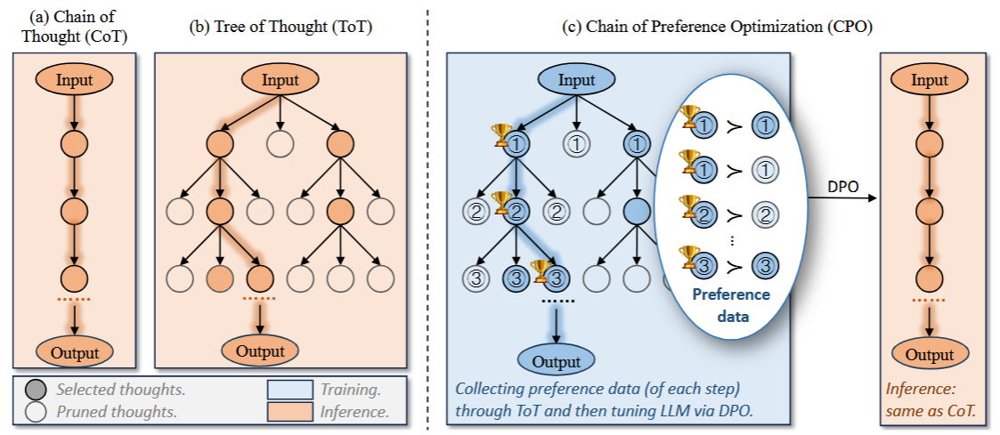
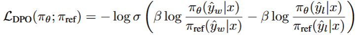
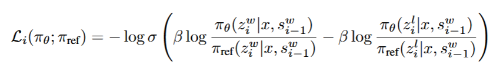
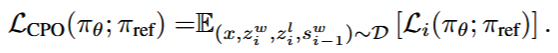
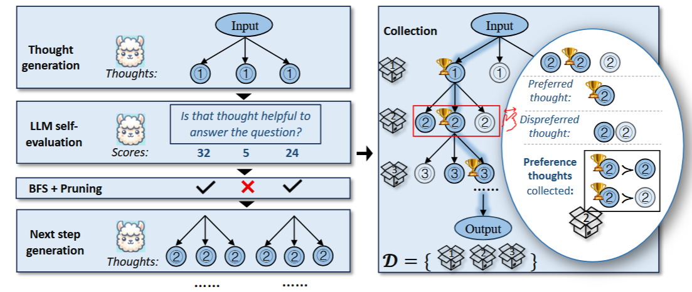
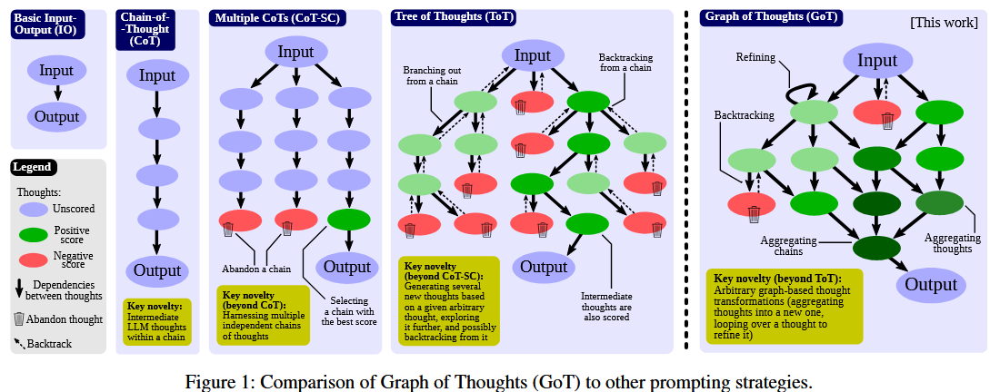
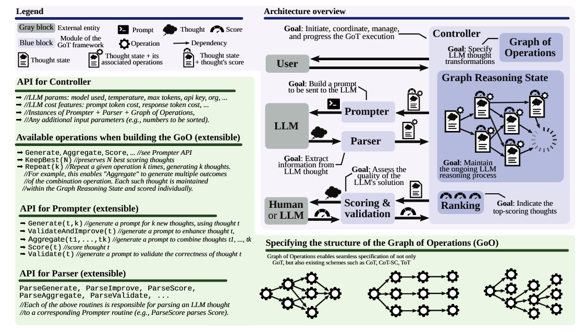

# **1. [CPO](https://proceedings.neurips.cc/paper_files/paper/2024/file/00d80722b756de0166523a87805dd00f-Paper-Conference.pdf) Chain of Preference Optimization: Improving Chain-of-Thought Reasoning in LLMs (26-5-31)**

本文提出ToT算法消耗计算资源的缺陷，提出基于偏好链的强化学习算法，在减少推理过程计算资源消耗的同时，保证了对于正确推理路径的偏好，提高了模型的推理能力。

## 现有缺陷
- 传统的思维链模型通过提示词要求模型输出推理步骤后再输出最终答案，但是这种方法推理路径单一，推理能力有限
- ToT算法通过将思维过程建模为树搜索的方式，通过思维产生器来生成多个候选路径，再通过评估模型进行打分，最后通过树搜索得到最优路径，但这种方法每次推理极其消耗计算资源，限制了其应用前景
- 现有方法通过ToT蒸馏出最优的推理路径，再通过SFT对LLM进行微调，但是，这种方法没有利用推理路径搜索过程中的偏好信息，直接将次优的信息抛弃了，而教会模型判断优劣使至关重要的，而这种避坑经验往往非常重要

      

因此作者通过ToT构造出每步推理过程的偏好对，再通过DPO强化学习算法进行训练。

### DPO原理

具体而言，DPO算法公式如下，其中${y_w}$是被偏好的推理路径，而${y_l}$是次优的推理节点，${\pi_\theta}$是期望的优化的模型，而${\pi_{ref}}$是最初的SFT模型，该公式包含两项，每一项都表示，当优化模型${\pi_\theta}$生成该答案的概率比参考模型${\pi_{ref}}$大的时候，log中为正值，得到奖励；而两项相减意味着，模型对于偏好答案得到的奖励需要比次优答案得到的奖励更高。

      

## 做法

受益于DPO和ToT的思想，作者将CPO分为两个部分，分别是偏好思维链生成过程和CPO训练过程

1. 阶段1：偏好思维链生成过程

- 思考生成过程：将输入问题和前序思维输入模型，产生多个候选思维节点
- 状态评估：将新生成的思维节点和前序问题与节点合并，并对该过程多次打分取均值。
- 搜索与收集：通过BFS搜索最优推理路径作为偏好数据，而针对每个推理步骤的最优节点，取其同父亲节点的兄弟节点作为次优节点，从而构造偏好数据对

2. 阶段2：训练CPO的目标

- 仿照DPO的训练目标，根据提取的推理偏好节点对z，设计训练的损失目标。s表示当前的状态(问题+前序推理步骤)，x为输入，z为候选的推理节点。

      

      

      

# **2. [GoT](https://ojs.aaai.org/index.php/AAAI/article/view/29720) Graph of Thoughts: Solving Elaborate Problems with Large Language Models (26-6-1)**

借鉴于思维链、思维树的模型，提出了思维图的结构，允许模型通过在图状结构中进行思考，提高了模型的推理能力。

## 现有缺陷

- COT思维模式是单向的、线性的，推理能力有限
- TOT允许模型在思考时分叉，遇到死胡同能够进行回溯
- 但是人类在思考过程中通常会将多个idea的优点结合起来，合成一个更加完美的方案C
- 同时，人类在思考过程中还会对脑海中的思维进行反复的修改和打磨，这些通过树结构难以做到

      

## 做法

- 作者定义了多种针对思维节点的操作，来构造思维图结构。

1. 针对整个思维图状态，生成思维节点和边，并且允许对某些节点和边进行删除
2. 通过多个思维节点，聚合为一个新的思维节点
3. 对某个思维节点进行自循环精炼
4. 对某个单一的思维节点产生多个候选的子思维节点。

- 作者将算法结构分为了五个部分。

1. Prompter: 负责将图节点的信息拼接到提示词发送给LLM
2. Parser：负责将LLM回复的关键信息提取出来，更新GRS
3. Scorcing & validation: 负责借助LLM或人工对图结构提出的思维节点进行评分
4. Controller: 负责从GRS中选择想法，负责对哪些想法进行什么样的转换，整个流程是否结束，是否进行下一轮的流程等，这些流程往往由人工编写的GoO定义。
5. GoO & GRS: GoO是一个针对任务的静态计划，其预定义来针对哪些节点应该执行什么操作，任务该在什么时候结束等信息。GRS维护着所有的历史操作，包括思维状态、进行的操作和相应的得分。

- 作者提出该模型能够应用到各种API的大模型中，具有扩展性强的优势。

      

## 缺陷

该方法的推理消耗非常大，通常需要经过多次的LLM的聚合和打分操作，其次，模型不能自行探索图结构，很大程度上依赖于预定义的规则，限制来方法的泛化性。